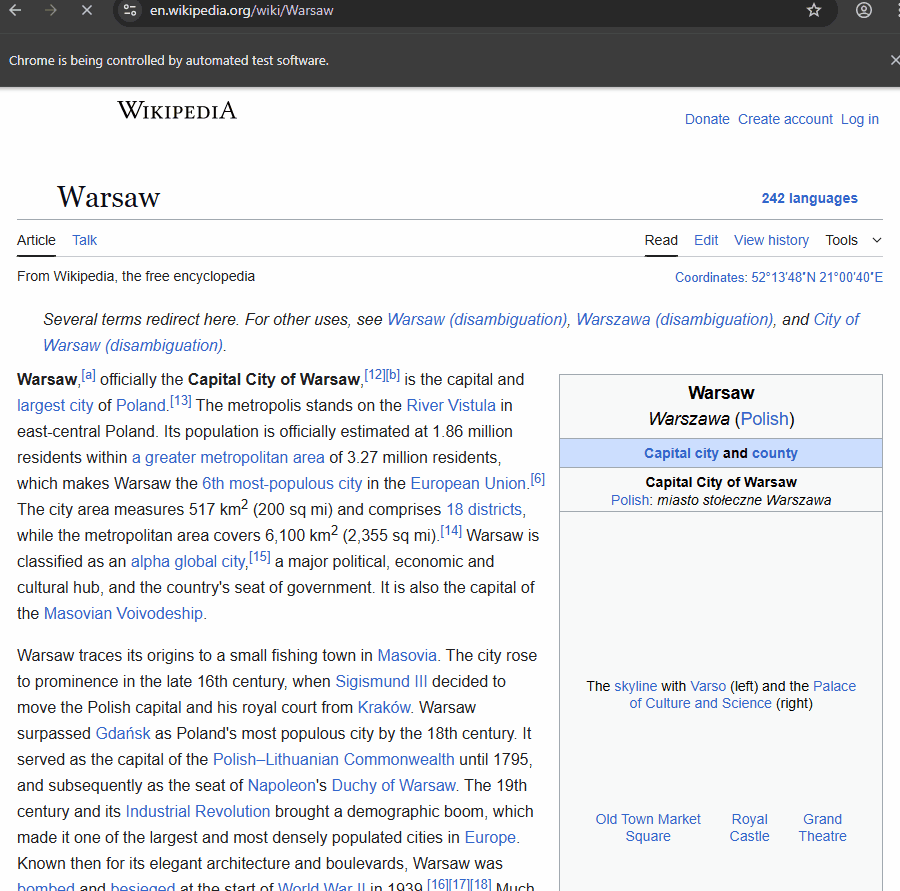

# Wiki Speedrun

A fun side project to see if I can automate the popular wiki speedrun game where you use links on a wiki page to reach an target wiki page. 

Inspired by [Green Code](https://www.youtube.com/@Green-Code) from his video : https://www.youtube.com/watch?v=JvoUHe1OR68

This is simple version which leverages the GloVe embeddings to find out the most promising link from the list of links on the current page and navigates till it reaches the target page.

## Resources used:

Understanding GloVe embeddings : https://muneebsa.medium.com/mastering-nlp-with-glove-embeddings-word-similarity-sentiment-analysis-and-more-27f731988c48

List of existins speedruns present in suggested.json : https://wikispeedruns.com/

Selenium navigation logic ( reused a crawler I made for my college final year project) : https://github.com/harsha0571/Automated_NLP_Based_Data_Handler/blob/main/Crawler.py

## Sample

Below is the demo run from "Warsaw" to "Research"

Current version is not very optimal , need to filter the list of links on the page to only check from viable links.
As we are hitting a bunch of invalid links we end up at the wiki home page which sort of beats the point of starting from a specific page as the progress resets when this happens.
